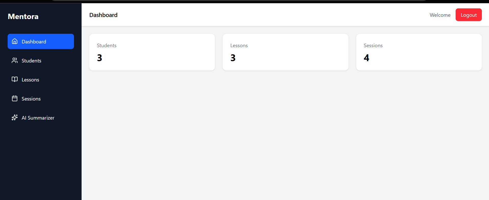
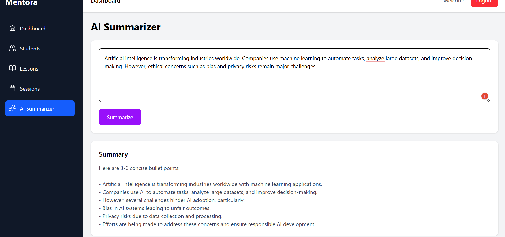

## Backend API

Backend server:

https://github.com/Whitedevil-cloud-ux/mentora-backend

# Mentora – AI Powered Mentorship Platform

Live Demo: mentora-frontend-kappa.vercel.app

Mentora is a full-stack mentorship management platform that allows mentors and parents to manage students, lessons, and sessions while leveraging AI to summarize learning material.

## Tech Stack
Frontend: React, TailwindCSS  
Backend: Node.js, Express  
Database: MongoDB Atlas  
AI: Groq LLM API  
Deployment: Vercel + Render

## Screenshots

### Dashboard

### AI Summarizer

